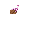

# Hi there, I'm Ningthangom - aka [Angelo][website] 👋 

## I'm a student, musician, farmer, full stack developer!!

<!-- - 🔭 Check out my VS Code course: [Become A VS Code SuperHero!][course]! -->
- 🌱 I’m currently learning TypeScript😎
- 👯 I’m looking to collaborate with other full stack JavaScript Developers
- 🥅 2022 Goals: Learn more about full stack mobile app development
- ⚡ Fun fact: I love to play guitar, sing and have bbq with friends and family

### Connect with me:

&nbsp;&nbsp;

### Languages and Tools:

 
 
  
 ---

  
:zap: GitHub Stats

  

[website]: https://angelo101.netlify.app/

